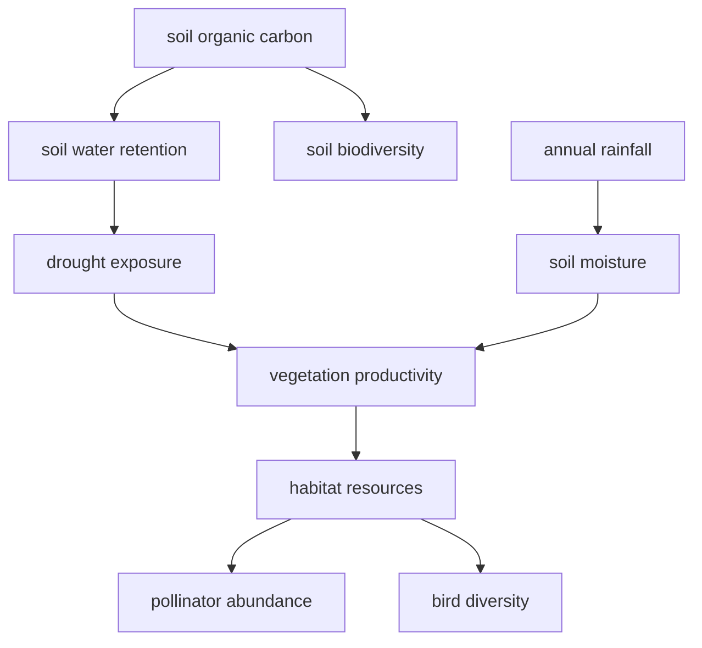

# Darukaa.Earth BioIntel

**An AI conversational system for biodiversity and land-management decisions, where the reasoning is not done by the language model.**

Built for the Darukaa.Earth AI Biodiversity Intelligence challenge.

[](https://github.com/OWNER/REPO/actions/workflows/ci.yml)

---

## The one thing that matters

The brief excludes "generic LLM-only solutions". So this system's default
configuration is `LLM_PROVIDER=none`.

Run it with no API key, no network and no database server. It still produces
every diagnosis, every ranked recommendation, every score component, every
citation, every confidence statement and every monitoring plan. A deterministic
rule engine, a 44-edge causal graph and an explicit weighted scoring formula do
the reasoning. The LLM — if you enable one — only rewrites the finished result
as prose, and if it introduces a number the registered evidence does not
support, its output is rejected wholesale and the deterministic text ships
instead.

**You can unplug the model and the intelligence remains.**

---

## Run it in 60 seconds

```bash
git clone <this-repo> && cd darukaa-biointel
pip install -r requirements.txt
python scripts/ingest_documents.py --force    # builds the evidence index
uvicorn app.main:app --reload                 # API on :8000
streamlit run frontend/streamlit_app.py       # UI  on :8501
```

No `.env` needed. No API key. No Postgres. Then:

```bash
curl localhost:8000/health
curl localhost:8000/demo/semi-arid-farm
curl localhost:8000/demo/pollinator-decline
```

With Docker:

```bash
docker compose up --build     # API :8000, UI :8501, PostgreSQL 16 + pgvector
```

---

## What it does that a generic chatbot does not

### 1. It refuses the obvious answer when the evidence says the obvious answer is wrong

Ask about declining pollinators under high pesticide pressure. The naive answer
is "plant flowering strips". This system will not give it, because the IPBES
2016 Pollinators Assessment records that adding forage while exposure stays high
draws foragers into a treated area. Flowering strips carry a hard
`requires_pairing_with: [INT_PESTICIDE_IPM]`, so the system cannot emit them
alone under that configuration. It recommends nesting substrate instead — a
different bottleneck that does not increase exposure.

Two more encoded in the knowledge base:

- **Tree cover → groundwater recharge is hump-shaped** in dry regions (Ilstedt
  et al. 2016). The agroforestry intervention is *dispersed parkland at
  intermediate density*, and its recharge effect is returned as
  `non_monotonic` — not "plant more trees".
- **Reduced tillage is never recommended standalone** (Pittelkow et al. 2015),
  because alone it can cost yield without delivering the carbon gain.

### 2. It models how stressors compound, not just that they co-occur

Ten interaction rules, each with its own mechanism statement, its own evidence
and an amplification factor. The water-stress demo fires three at once. The one
that separates real reasoning from pattern-matching:

> **Overdraft caps the return on any water-retention measure.** Where withdrawal
> exceeds recharge, infiltration gains are drawn back out. Supply-side measures
> have a ceiling set by the demand side, so recommending only retention
> structures would overstate the achievable outcome.

### 3. It asks rather than guessing

Send "biodiversity is declining on my property" with nothing else. It returns
`mode: "clarification"` and **zero recommendations**, plus three questions ranked
by an explicit information-gain model:

```
information_gain = variable_importance × recommendation_sensitivity
                   × uncertainty × concern_relevance
```

Uncertainty decays at 0.75ⁿ within a variable group, so a second soil question
is worth less than the first. Each question ships with why it matters.

### 4. It will not let you silently contradict yourself

```
Turn 1  "Soil organic carbon is 0.3%…"
Turn 2  "Actually soil organic carbon is 1.8%"
```

> Earlier you indicated soil organic carbon pct of 0.3 %, and now 1.8 %. Which
> value should I use? I will not overwrite the earlier figure until you confirm.

The measurement table is append-only; a corrected value supersedes rather than
erases.

### 5. It cannot fabricate a statistic

Numbers exist in the knowledge base only as registered claims — each with a
variable, direction, magnitude, **study context** and confidence. Generated prose
is scanned and any numeric assertion no claim supports is stripped, with the
removal recorded in the trace. A study's finding is always rendered with its
context attached and explicitly marked as not a prediction for the user's site.

---

## Architecture

```
user text + optional JSON + optional lat/lon
   │
   ├─ 1  Input parser ......... unit-aware patterns; emits a variable only with a text span
   ├─ 2  State builder ........ session memory, provenance, contradiction hold-back
   ├─ 3  Structured retrieval . region-aware bands, 13 diagnostic rules
   ├─ 4  Hybrid RAG ........... 0.45 dense + 0.25 BM25 + 0.20 variable-overlap + 0.10 tier
   ├─ 5  Reasoning engine ..... tri-state conditions, 10 interaction rules, graph traversal
   ├─ 6  Ranking .............. explicit 6-component weighted formula
   ├─ 7  Claim validation ..... unsupported numerics stripped
   ├─ 8  Narration ............ deterministic templates, or LLM + re-validation
   └─ 9  Structured response + full reasoning trace
```



Generated by `app/services/reasoning/graph.py` from the semi-arid demo — not
hand-drawn. Each edge has an id, a mechanism sentence and at least one source.

Full detail: [`docs/architecture.md`](docs/architecture.md)

### Scoring formula

```
score = 0.30·multi_metric_fit
      + 0.25·evidence_strength
      + 0.20·impact_potential
      + 0.10·context_fit
      + 0.10·feasibility
      + 0.05·co_benefit
```

Every weight is an environment variable. Every component returns a rationale
string. Nothing in this formula is produced by a language model.

---

## Knowledge base

| Asset | Count | File |
| --- | --- | --- |
| Scientific sources | 33 | `data/evidence/sources.json` |
| Registered quantitative claims | 40 | same |
| Environmental variables | 33 | `data/structured/variables.json` |
| Causal relationships | 44 | `data/structured/relationships.json` |
| Interventions | 20 | `data/structured/interventions.json` |
| Diagnostic rules | 13 | `data/structured/diagnostic_rules.json` |
| Interaction rules | 10 | `app/services/reasoning/engine.py` |
| Indexed evidence chunks | 74 | built by `scripts/ingest_documents.py` |

Sources include Poeplau & Don 2015, Lal 2004, FAO/ITPS SWSR 2015, Tamburini
2020, Beillouin 2021, Bowles 2020, Haddad 2015, Kremen & Merenlender 2018,
Gilbert-Norton 2010, IPBES 2016 and 2019, Garibaldi 2013, Pywell 2015, Dainese
2019, IPCC SRCCL 2019, IPCC AR6 WGII 2022, Pittelkow 2015, Ilstedt 2016, Zomer
2016, UNCCD GLO2 2022 and others. Every entry carries a DOI or URL and a quality
tier; contested sources carry a caveat surfaced at every citation.

No source text is reproduced — all synopses are original paraphrase.

**Verify the citations yourself:**

```bash
python scripts/verify_sources.py        # resolves every DOI and URL; exits non-zero on failure
```

Full list and policy: [`docs/scientific_sources.md`](docs/scientific_sources.md)

---

## Database schema

| Table | Purpose |
| --- | --- |
| `environmental_profiles` | Session location, region, concerns |
| `environmental_measurements` | **Append-only** variable values with provenance, band and turn; corrections set `superseded` |
| `interventions`, `intervention_metrics` | Intervention library and per-metric expected effects |
| `evidence_sources` | Sources with DOI/URL, tier, scope, caveat |
| `document_chunks` | Embedded text — JSON on SQLite, `vector(512)` on PostgreSQL + pgvector |
| `environmental_relationships` | The 44 causal edges |
| `conversations`, `conversation_messages` | Turn history with extracted variables and cited sources |

SQLite by default. Point `DATABASE_URL` at PostgreSQL and the identical models
run there; `docker-compose.yml` provisions PostgreSQL 16 with pgvector.

Persistence is best-effort by design — the pipeline is pure, so if the database
is unreachable the API still answers.

```bash
python scripts/seed_database.py     # creates tables and loads the knowledge base
```

---

## API

| Method | Endpoint | Purpose |
| --- | --- | --- |
| POST | `/chat` | Conversational turn with memory |
| POST | `/analyze` | One-shot analysis |
| POST | `/environmental-profile` | Normalise and band a structured payload |
| POST | `/retrieve` | Raw hybrid retrieval with every fusion component |
| POST | `/recommend` | Stateless ranking — all candidates, all score components |
| POST | `/counterfactual` | Re-run on a modified state; reports entered / dropped / rank-delta |
| GET | `/health` | Knowledge counts, provider config, scoring weights |
| GET | `/sources`, `/sources/{id}` | Evidence catalogue |
| GET | `/knowledge/graph` | Causal graph, optionally traversed for one stressor |
| GET | `/interventions` | Intervention library |
| GET | `/session/{id}` | State, variable history, open contradictions |
| POST | `/session/resolve` | Confirm which value to use after a contradiction |
| GET | `/debug/reasoning/{session_id}` | **Full trace**: query → extraction → retrieval scores → rules → candidates → validation → timings |
| GET | `/demo`, `/demo/{slug}` | Five preloaded scenarios |

Interactive docs at `/docs`.

### Example

```bash
curl -X POST localhost:8000/chat -H 'content-type: application/json' -d '{
  "message": "Biodiversity and yields are both declining",
  "environment": {
    "soil":     {"organic_carbon_pct": 0.3, "ph": 7.9},
    "climate":  {"annual_rainfall_mm": 400, "temperature_mean_c": 27},
    "land_use": {"primary_crop": "wheat", "cropping_system": "monoculture",
                 "tillage": "conventional", "tree_cover_pct": 2},
    "location": {"region": "semi_arid"}
  }}'
```

---

## Demo scenarios

| Slug | What it demonstrates |
| --- | --- |
| `semi-arid-farm` | Carbon × water compounding; non-monotonic tree-cover effect |
| `pollinator-decline` | The system refusing the naive "plant flowers" answer |
| `habitat-fragmentation` | Two constraints limiting the same recovery |
| `water-stress` | Three simultaneous interactions, including the governance ceiling |
| `incomplete-information` | Clarification behaviour — zero recommendations, ranked questions |

Worked outputs for all five: [`docs/reasoning_examples.md`](docs/reasoning_examples.md)

---

## Testing and CI

```bash
pytest tests -q                              # 35 tests
python scripts/evaluate_system.py            # rubric-proxy harness
ruff check app scripts tests frontend
```

The evaluation harness scores the five rubric dimensions against the
**structured response**, not the prose, so the score cannot be gamed by wording.
Checks that do not apply to a given scenario are marked not-applicable and the
remaining weights renormalised, rather than scoring correct behaviour as failure.

GitHub Actions (`.github/workflows/ci.yml`) runs lint → knowledge-base
validation → index build → database seed → tests → evaluation harness on Python
3.11 and 3.12, then builds the Docker image and smoke-tests the running
container.

---

## Configuration

Everything has a working default; see `.env.example`. The ones worth knowing:

| Variable | Default | Notes |
| --- | --- | --- |
| `LLM_PROVIDER` | `none` | `openai` / `anthropic` / `ollama` optional |
| `EMBEDDING_PROVIDER` | `hashing` | Deterministic, offline. `sentence_transformers` for better semantics |
| `DATABASE_URL` | SQLite | Any SQLAlchemy URL |
| `MIN_VARIABLES_FOR_RECOMMENDATION` | `3` | Below this the system asks instead of answering |
| `STRICT_CLAIM_VALIDATION` | `true` | Strips unsupported numerics from generated prose |

---

## Limitations

Stated plainly, because an audit that marks everything green is worthless. Full
version: [`docs/final_rubric_audit.md`](docs/final_rubric_audit.md)

1. **No site-level magnitude predictions.** Deliberate. The system gives
   direction, horizon and confidence, and attributes every number to its study
   context. Predicting "+0.4% SOC in 5 years" from a handful of variables would
   be unsupportable.
2. **Geospatial providers are interfaces with labelled fallbacks**, not live
   integrations. The code declares where a real land-cover, SoilGrids or GBIF
   adapter plugs in, and never presents a fallback as a site measurement.
3. **The corpus is global/temperate-weighted.** Tropical and South Asian primary
   studies are under-represented relative to European ones.
4. **Default embeddings are hashed n-grams**, chosen for reproducibility over raw
   semantic quality; the hybrid fusion carries most of the ranking. One env var
   swaps in a real encoder.
5. **The NL extractor is conservative.** It prefers to miss a variable — which
   triggers a clarifying question — over inventing one. Structured JSON is the
   reliable input path and the UI offers it alongside chat.
6. **Not a substitute for a soil test or an agronomist**, and the system says so
   in its own output where a recommendation rests on an estimated measurement.

---

## Future scope

- Live land-cover, SoilGrids and GBIF adapters behind the existing interfaces
- Regional evidence packs so tropical smallholder systems draw on
  regionally-specific studies
- Learned weights for the scoring formula, fitted against monitored outcomes
- Time-series ingestion so the monitoring plan closes the loop and revises
  confidence as observations arrive
- Multilingual input for field use

---

## Project layout

```
app/
  api/routes.py              14 endpoints
  core/                      config, structured JSON logging with secret redaction
  schemas/                   environmental state, structured response
  models/db.py               9-table SQLAlchemy schema
  database/                  engine, best-effort persistence, pgvector DDL
  services/
    conversation/            extractor, memory + contradictions, clarification engine
    knowledge/store.py       knowledge base with fail-fast reference validation
    rag/                     embeddings, vector store, ingestion, hybrid retriever
    reasoning/               tri-state conditions, causal graph, diagnostic engine
    recommendations/         scoring, monitoring protocols, engine, counterfactual
    evidence/validator.py    claim-evidence validation
    geospatial/providers.py  adapter interfaces with labelled fallbacks
    llm/                     optional client + narrator with re-validation
    pipeline.py              the orchestrator
frontend/streamlit_app.py    8-tab inspection UI
data/                        knowledge base (JSON) + evidence corpus drop-zone
scripts/                     ingest, embeddings, seed, evaluate, verify_sources
tests/                       35 tests
docs/                        architecture, rubric alignment, examples, sources, audit
```

## Licence

MIT — see [LICENSE](LICENSE).
